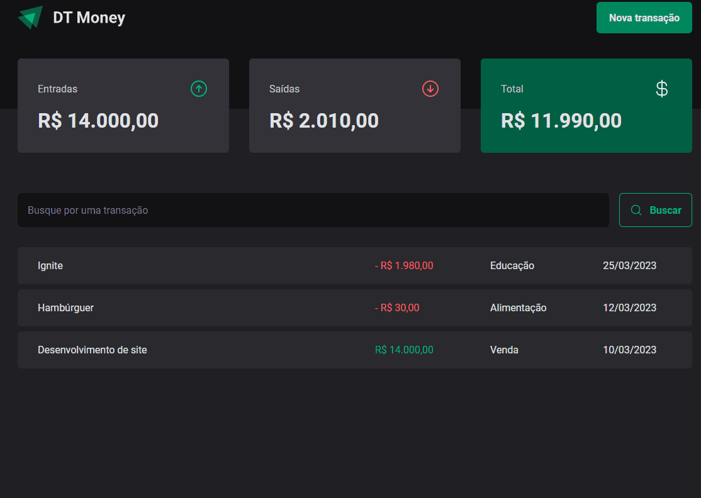

# Dt Money 💵
Projeto realizado no curso da Rocketseat🚀 na trilha React do Ignite. Nesse projeto será construida uma aplicação front-end web completa, conectando a uma API e será visto como performar aplicações com o React entendendo como funcionam os algoritmos internos da biblioteca e todo fluxo de renderização de componentes.



## Tecnologias usadas ⚙
  - React.js
  - Typescript
  - Styled Components
  - Radix
  - JSON Server
  - React Hook Form
  - Zod
  - Axios
  - Vite

## Ultima atualização 🔃
- Usando biblioteca Axios para requests da api
- Adicionando novas transações

## Como utilizar
- Clone o projeto do repositório
```
git clone https://github.com/RafaelMatos/DtMoney.git
```
- Acesse a pasta do projeto
```
cd DtMoney
```
- Instale as dependências 
```
yarn
```
- Execute o JSON Server
```
yarn dev:server
```
- Em outro terminal, execute o projeto
```
yarn dev
```

- Acesse no navegador o endereço indicado no terminal


